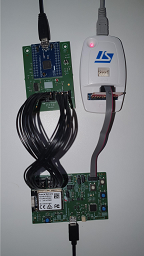
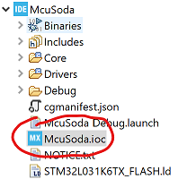
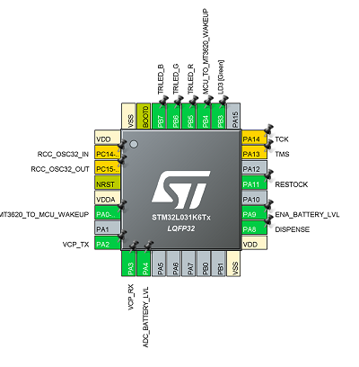
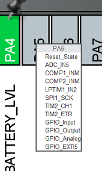
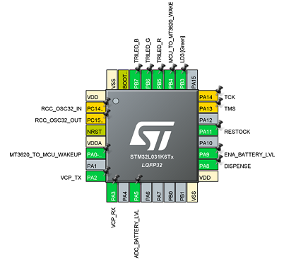
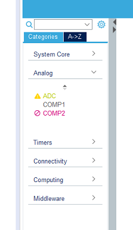
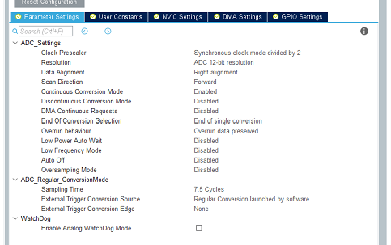
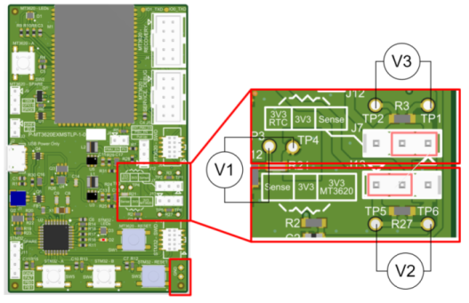

# Azure Sphere Low Power External MCU To Cloud Reference v1.0 Design and Production Files

This project provides a hardware reference design that demonstrates how to integrate an MT3620 module and an external MCU onto a single printed circuit board (PCB) with a low-power design.  Specifically, it incorporates an ultra-low-power [STM32L031](https://www.st.com/en/microcontrollers-microprocessors/stm32l031k6.html) microcontroller and an Azure Sphere module from [Avnet](https://www.avnet.com/shop/us/products/avnet-engineering-services/aes-ms-mt3620-m-g-tr-3074457345641969195/) in a design implemented on a 4 layer printed circuit board (PCB) with a total thickness of approximately 1.6mm. The architecture showcases the following:

1. Low power features of Azure Sphere [Power Down State](https://docs.microsoft.com/azure-sphere/app-development/power-down).
2. Secure communication with IOT Central [Software repository](https://docs.microsoft.com/azure/iot-central/core/overview-iot-central).
3. Over-the-air (OTA) firmware update of the external STM32 microcontroller using Azure Sphere.

## Usage Notes

The board can be powered either by a battery pack or through the onboard micro-USB port. An on-board power OR-ing circuit ensures power is consumed from the micro-USB port if connected. The micro-USB socket on the board is used for Power input only.

To facilitate the low power features of Azure Sphere, the system has two 3.3V Buck converters.

- One of the 3.3V lines is always ON and powers the STM32 microcontroller
- The second 3.3V is switched off by the MT3620 when it enters low power mode

The MT3620 on the Avnet module has the following features available in this design:

- Dedicated Reset button (MT3620 - RESET)
- Spare button for user input (MT3620 - SPARE)
- Dedicated RGB LED (MT3620 - LEDs)
- One PWM output and one ADC input (MT3620 - SPARE)

The board is designed to interface with the Azure Sphere [FTDI Interface board](https://github.com/Azure/azure-sphere-hardware-designs/tree/master/P-FTINT-1-1). This provides a way to connect the board to a host computer via a USB port for programming/debugging/recovering as with an MT3620 RDB.

The STM32L031 microcontroller supports the following features which are available in this design:

- Dedicated Reset button (STM32 - RESET)
- Two spare buttons for user input (STM32 - A, STM32 - B)
- Dedicated RGB LED (D3)
- Three Spare GPIO or ADC input (STM32 - SPARE)
- Battery voltage level reader

The board has a 10-pin SWD header for programming/debugging the STM32 microcontroller. You will need an [ST-Link programmer]( https://www.st.com/en/development-tools/st-link-v2.html) and an [adapter board](https://www.olimex.com/Products/ARM/JTAG/ARM-JTAG-20-10/) to convert from the 20-pin STM32 connector on the ST-Link programmer to the 10-pin SWD on the debug/programming board.

## Directory contents

This project contains the design files for the Device To Cloud - External MCU, Low Power reference design. These consist of the following:

- Altium P-MT3620EXMSTLP-1-0  folder contains the Altium Designer schematics, PCB layout, and supporting project files.
  - FTDIProgrammer.Harness      describes FTDI programmer signal harness between multiple schematic sheets.
  - FTDIProgrammer.SchDoc       describes FTDI programming interface.
  - MT3620AvnetModule.SchDoc    describes the Avnet module interface.
  - P-MT3620EXMSTLP-1-0.OutJob  describes the PCB output generation structure.
  - P-MT3620EXMSTLP-1-0.PcbDoc  describes the PCB design.
  - P-MT3620EXMSTLP-1-0.PrjPcb  is the Hardware design project file for Altium.
  - PowerSupply.SchDoc          describes the power management unit.
  - STM32L031.SchDoc
  - TopLevelBlock.SchDoc          describes the top level block diagram for the hardware design and schematic flow.
- Production P-MT3620EXMSTLP-1-0  folder contains the gerber, drill, and pick and place data files, along with a detailed variant report file.
   - Gerber                       folder contains the files needed for PCB manufacture.
   - NC Drill                     folder contains the files needed for PCB manufacture.
   - Pick Place                   folder contains the files needed for population of the PCB.
   - VariantReport.html           describes the different PCB variants.
- P-MT3620EXMSTLP-1-0 _PCB StackUp (Production).PDF        is a report on the PCB stack up required for manufacture.
- P-MT3620EXMSTLP-1-0_BOM (Production).xlsx                is an Excel spreadsheet that contains the bill of materials.
- P-MT3620EXMSTLP-1-0_Schematic (Production).PDF           is a collection of the schematic documents in PDF format.

## Deploying the software reference solution on the hardware reference design PCB

To run the [DeviceToCloud reference solution](https://github.com/Azure/azure-sphere-samples/tree/master/Samples/DeviceToCloud) on the hardware reference design PCB, follow the instructions in the [BuildMcuToCloud.md](https://github.com/Azure/azure-sphere-samples/blob/master/Samples/DeviceToCloud/ExternalMcuLowPower/BuildMcuToCloud.md) file, starting from [Build and deploy the MCU app](https://github.com/Azure/azure-sphere-samples/blob/master/Samples/DeviceToCloud/ExternalMcuLowPower/BuildMcuToCloud.md#build-and-deploy-the-mcu-app). You will first need to make the following changes:

- Modify the DeviceToCloud reference solution [cmakelists.txt](https://github.com/Azure/azure-sphere-samples/tree/master/Samples/DeviceToCloud/ExternalMcuLowPower/AzureSphere_HighLevelApp) file to point to the hardware definition for the board.

    For example, `azsphere_target_hardware_definition(${PROJECT_NAME} TARGET_DIRECTORY "../HardwareDefinitions/msft_m2c_hwref" TARGET_DEFINITION "soda_machine.json")`.

- Update the STM32 application, [McuSoda](https://github.com/Azure/azure-sphere-samples/tree/master/Samples/DeviceToCloud/ExternalMcuLowPower/McuSoda), to work with the hardware reference solution.

   1. Open the solution in the STM32 Cube IDE, and open the file McuSoda.ioc:

      

   1. You may at this point be prompted to migrate the project to a newer firmware version. Don’t do this, just click **Continue**. You should see the following:

      

   1. Click on **PA5** and select **ADC_IN5**.

      

   1. Click on **PA4** then  click on **Reset_State**
   1. Right-click on **PA5**, click on **Enter user label** and enter “ADC_BATTERY_LVL”. You should see the following:

      

   1. In the left panel, expand the **Analog** section and double click on **ADC**.

      

   1. In the configuration pane select the **Parameter Settings** tab. The settings should match the following:

        

   1. Press the Ctrl-S to save the settings then rebuild and deploy the application.

- Where the [Build and deploy the MCU app](https://github.com/Azure/azure-sphere-samples/blob/master/Samples/DeviceToCloud/ExternalMcuLowPower/BuildMcuToCloud.md#build-and-deploy-the-mcu-app) instructions say to connect development boards to the PC, instead connect the custom hardware as described and illustrated above.

## Current monitoring on hardware
The hardware provides headers and current sense resistors for monitoring the current consumption of the MT3620 chip.
On-board sense resistors can be added to the power rail and the differential voltage across it can be measured using a Voltmeter on the available test points.

| Name        | Description           | Sense Resistor  | Test Points |
| :-------------: |:-------------:| :-----:| :-----: |
| V1      | Always ON 3.3V powering RTC and STM32 | R21 - 0R link  (should be changed if used) |TP3 and TP4 |
| V2      | RTC 3.3V that is always ON |R3 - 100R |   TP1 and TP2 |
| V3 | MT3620 3.3V that is switched OFF in low power (RTC modes) | R27 - 0.1R |TP5 and TP6 |

## Compatibility Note

The Avnet module V1 is used in this design. This design is also compatible with the V2 of the Avnet module - see considerations listed on Page 3 of Schematic.

## Wakeup and Reset

When the chip enters PowerDown mode, the MT3620 reset button on the board has no effect, i.e. pressing the reset button does not reset or wake the chip from PowerDown mode. This shortcoming has been addressed in the latest version of the MT3620 RDB (v1.7), but this design has not been updated with those changes. See the [RDB v1.7 design](https://github.com/Azure/azure-sphere-hardware-designs/tree/master/P-MT3620RDB-1-7) for more details.